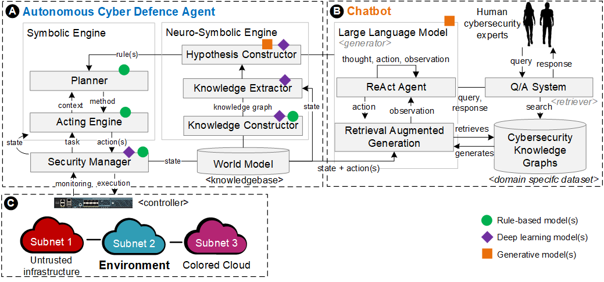

# Autonomous Cyber Defence Agent 

## Introduction

The goal is to design and implement deployable autonomous agents that can efficiently defend a protected network segment supporting information exchange between two or more nations in a coalition using the set of NATO standards for PCN (Protected Core Networking). This investigation is motivated by recent breakthroughs in deep learning and generative AI, which have the potential to enhance the effectiveness of autonomous cyber defence solutions for communication networks used by the military.

## Agent Design

Our autonomous agent combines hybrid AI models, to detect and mitigate cyber threats, as illustrated in the figure below (A) and defined as follows.

* Security Manager: The Security Manager sits at the interface between the agent and the environment. It implements actions at runtime and provides feedback to other components of the agent, allowing the agent to interleave planning and acting in real time.

* Acting Engine: The Acting Engine receives tasks and current state information from the Security Manager, requests a course of action from the Planner, and manages the interleaved acting and planning (including any re-planning that may be necessary).    

* Planner: Given a domain-specific operational model (a set of candidate actions mapped into a hierarchy of tasks and methods to accomplish those tasks) and information about the current state, the Planner searches the available action space using Monte Carlo rollouts to compute courses of action to most effectively defend or recover the system. As actions are carried out in the environment, the planner may be called to adjust or re-plan if any of those actions fail or have side-effects.

* World Model: The representation of all of the knowledge available on systems, cybersecurity, the history of all of the cyberattacks, and also how the environment works, its components, and its current state.    

* Knowledge Constructor: The Knowledge Graph is constructed with the use of multiple cybersecurity databases, on all the known cyberattacks, mitigations, and more generally all information that could be useful in dealing with a cyberattack.

* Knowledge Extractor: The Knowledge Extractor uses the Knowledge Graph to understand the current state of the system, and to get all of the context that might be useful to process the state.    

* Hypothesis Constructor: Using the context provided by the Knowledge Extractor, the Hypothesis Constructor makes recommendations on which actions to take to manage the situation. The Hypothesis Constructor also updates the World Model to add new information gathered while defending the environment.

* Large Language Model: The LLM serves as an interface between the Human Experts and the Hypothesis Constructor to keep the Human Experts updated on the state of the system, the cyberattacks that are being dealt with, and changes to the World Model. It ensures that the model remains explainable and that it does not become a black box.

* Cybersecurity Knowledge Graph: The set of structured knowledge compile from heterogeneous sources representing the sum of human expertise in cybersecurity.
                   

The agent employs an actor-critic DRL (Deep Reinforcement Learning) model using PPO (Proximal Policy Optimization) with the following architecture.

        self.actor = nn.Sequential(
            nn.Linear(state_dim, 64),
            nn.ReLU(),
            nn.Linear(64, 64),
            nn.ReLU(),
            nn.Linear(64, action_dim),
            nn.Softmax(dim=-1)
        )

        self.critic = nn.Sequential(
            nn.Linear(state_dim, 64),
            nn.ReLU(),
            nn.Linear(64, 64),
            nn.ReLU(),
            nn.Linear(64, 1)
        )

Decoys will be selected greedily from all available decoys, where we have 9 decoy actions which selected greedily from available decoys on their host.

        self.greedy_decoys = {1000: [55, 107, 120, 29],  # enterprise0 decoy actions
                              1001: [43],  # enterprise1 decoy actions
                              1002: [44],  # enterprise2 decoy actions
                              1003: [37, 115, 76, 102],  # user1 decoy actions
                              1004: [51, 116, 38, 90],  # user2 decoy actions
                              1005: [130, 91],  # user3 decoy actions
                              1006: [131],  # user4 decoys
                              1007: [54, 106, 28, 119], # defender decoys
                              1008: [61, 35, 113, 126]} # opserver0 decoys

Furthermore, if the buffer filled, the would pick the Remove action on that host. 

    # select the top remaining decoy
    def select_decoy(self, host):
        try:
            # pick the top remaining decoy
            action = [a for a in self.greedy_decoys[host] if a not in self.current_decoys[host]][0]
        except:
            # otherwise just use the remove action on that host
            action = self.host_to_remove[host]
        return action
                   
The agent also keeps track of scans. We maintained a list representing whether hosts had been scanned (value of 1) or not (value of 0) by implementing an add_scan method. Furthermore, the "latest" scan would have a value of 2 instead of 1 (this would allow the agent to keep track of recent activity).

    # add scan information
    def add_scan(self, observation):
        indices = [0, 4, 8, 12, 28, 32, 36, 40, 44, 48]
        for id, index in enumerate(indices):
            # if scan seen on defender, enterprise 0-2, opserver0 or user 0-4
            if observation[index] == 1 and observation[index+1] == 0:
                # 1 if scanned before, 2 if is the latest scan
                self.scan_state = [1 if x == 2 else x for x in self.scan_state]
                self.scan_state[id] = 2
                break

We then padded the observation received by the agent with this list.

    # concatenate the observation with the scan state
    def pad_observation(self, observation, old=False):
        if old:
            # useful for store transitions in DDQN
            return np.concatenate((observation, self.scan_state_old))
        else:
            return np.concatenate((observation, self.scan_state))
            
We are also keeping track of both the decoys and the scanning state.
 
    def end_episode(self):
        # 9 possible decoys: enterprise 0-2 and user 1-4, defender, opserver0 (cant do actions on user0)
        self.current_decoys = {1000: [], # enterprise0
                               1001: [], # enterprise1
                               1002: [], # enterprise2
                               1003: [], # user1
                               1004: [], # user2
                               1005: [], # user3
                               1006: [], # user4
                               1007: [], # defender
                               1008: []} # opserver0
        # 10 possible scans: defender, enterprise 0-2, user 0-4, opserver
        self.scan_state = np.zeros(10)
        # useful for store transitions in DDQN
        self.scan_state_old = np.zeros(10)
        
During evaluation instead of defaulting to a non-action action, it would select the next best available action. So at testing time, if the next best action is to decoy a host already full of decoys, then it would continue in the list.

                for action_ in max_actions[0]:
                    a = self.action_space[action_]
                    # if next best action is decoy, check if its full also
                    if a in self.current_decoys.keys():
                        if len(self.current_decoys[a]) < len(self.greedy_decoys[a]):
                            action = self.select_decoy(a,observation)
                            self.add_decoy(action, a)
                            break
                    else:
                        # don't select a next best action if "restore", likely too aggressive for 30-50 episodes
                        if a not in self.restore_decoy_mapping.keys():
                            action = a
                            break

While utilising the same hyperparamaters and action space as Attempt 2, and by making the changes to Host.py, we achieved a top score of -27 on Meander (1,000 episodes of length 100). It should be noted that we observed improvements before evaluation (therefore the better results were not only achieved by an enhanced policy at testing time).

The action space of the blue agent is defined as follows:

    action_space = [133, 134, 135, 139]  # restore enterprise and opserver
    action_space += [3, 4, 5, 9]  # analyse enterprise and opserver
    action_space += [16, 17, 18, 22]  # remove enterprise and opserer
    action_space += [11, 12, 13, 14]  # analyse user hosts
    action_space += [141, 142, 143, 144]  # restore user hosts
    action_space += [132]  # restore defender
    action_space += [2]  # analyse defender
    action_space += [15, 24, 25, 26, 27]  # remove defender and user hosts

CybORG (Cyber Operations Research Gym) implements two strategies for the red agent behavior, namely 'Meander' and 'B_line'. The 'Meander' agent aims to gain privileged access on all hosts in a subnet before moving on to the next one, eventually arriving at the operational server. This strategy simulates an attacker that has no knowledge about the victims network architecture. The B_line agent systematically explores each subnet directly targeting the operational server using prior knowledge of the network layout. The sequence of actions during a scenario follows the order of ACD, user, and then red agents. After execution of the actions, the ACD agent receives an observation and a reward based on the events triggered by users and red actions.

At testing time we selected the next best available action in the case where the decoy action was selected for a "full host". In addition, we turned the outputed probability distribution of PPO into a deterministic choice (by taking the argmax of the action vector). 

As a result we got two good policies, but how could we put them together for our final agent? Fortunately the policies kind of agree on the first three steps (given that it is deterministic, we can find the actions). The first two steps are always two decoys: Fermitter User2, Tomcat User2. The third action is also always a decoy but depends on the second action of the red agent.

| Agent      | User0 scan | User1 scan | User2 scan | User3 scan | User4 scan |
| ----------- | ----------- | ----------- | ----------- | ----------- | ----------- | 
| B_line PPO     | N/A     | Fermitter Ent1    |  Fermitter Ent1    | SMTP Ent0 | SMTP Ent0 | 
| Meander PPO     | Apache User2 | SMTP Ent0 | SMTP Ent0 | Apache User2     | Apache User2      |  

For the fourth action we would know if we are facing Meander or B_line as the former can be fingerprinted by two consecutive scans (on different hosts), therefore we could assign the appropriate agent. Fermitter Ent1 and SMTP Ent0 for B_line are very close to equivalent, but the concern is mostly for Meander when User2 hasn't been scanned since it appears ideal to keep utilising decoys on it. However, for a User 1 scan it prefers SMTP Ent0 so the improvement is likely negligible. As a result, we retrained two agents where we forced the first three actions/decoys to be Fermitter User2, Tomcat User2 and SMTP Ent0.

# Exemplary Outputs

The list below shows an exemplary output from the CybORG environment hosting the agents:

    Average reward for red agent B_lineAgent and steps 30 is: -5.3542 with a standard deviation of 3.9774089734577367
    Average reward for red agent RedMeanderAgent and steps 30 is: -5.537 with a standard deviation of 1.2877069500430558
    Average reward for red agent SleepAgent and steps 30 is: 0.0 with a standard deviation of 0.0
    Average reward for red agent B_lineAgent and steps 50 is: -12.956400000000002 with a standard deviation of 8.108878649539221
    Average reward for red agent RedMeanderAgent and steps 50 is: -8.823699999999999 with a standard deviation of 2.2577612353381817
    Average reward for red agent SleepAgent and steps 50 is: 0.0 with a standard deviation of 0.0
    Average reward for red agent B_lineAgent and steps 100 is: -36.891100000000044 with a standard deviation of 15.004240668158754
    Average reward for red agent RedMeanderAgent and steps 100 is: -16.4722 with a standard deviation of 3.8317527959785607
    Average reward for red agent SleepAgent and steps 100 is: 0.0 with a standard deviation of 0.0
